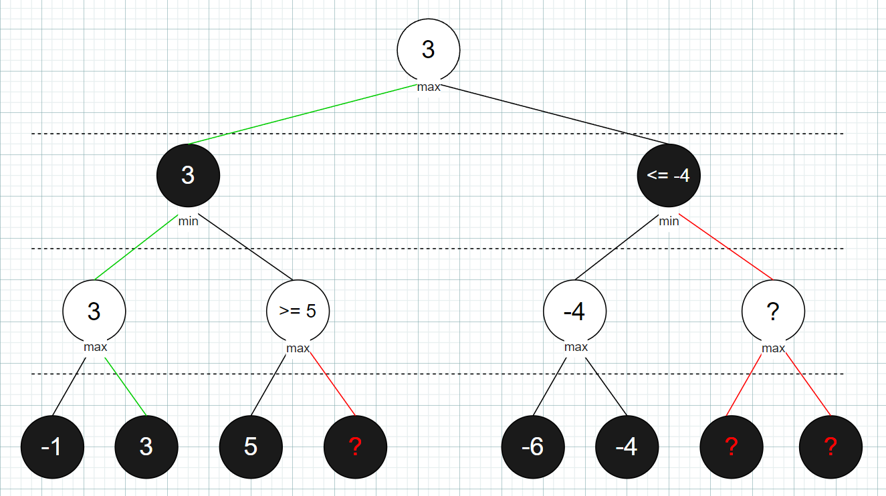

# Chess Engine 

Un moteur d'échec très simple et basique écrit en C# à partir de zéro. Il inclu le code de toute la logique du jeu, la représentation de l'échiquier, la recherche du meilleur coup et l'interface. J'ai beaucoup suivi les concepts du [Chess Programming Wiki](https://www.chessprogramming.org/).

Principalement réalisé pour le plaisir et pour apprendre les algorithmes utilisé dans les moteurs d'échecs et IA.

---

## Résultats

Testé contre Stockfish avec un contrôle du temps de 5min + 1s d'incrément (pour 40 coups).

Résultat sur 40 parties :

- vs Stockfish @ 2100 UCI elo :  24W - 12L - 4D  [65%]
- vs Stockfish @ 2150 UCI elo :  
- vs Stockfish @ 2200 UCI elo :  15W - 20L - 5D  [43.75%]

| Adversaire                 | Parties | Victoires | Défaites | Nulles | Score  |
|----------------------------|---------|-----------|----------|--------|--------|
| Stockfish @ 2100 UCI Elo   | 40      | 24        | 12       | 4      | 65%    |
| Stockfish @ 2150 UCI Elo   | 40      | 20        | 19       | 1      | 51.25% |
| Stockfish @ 2200 UCI Elo   | 40      | 15        | 20       | 5      | 43.75% |

**Force estimée : ~2150 UCI elo (même si on ne peut pas directement convertir un elo de moteur à un elo d'humain, c'est a peu près le niveau d'un joueur ~2300 elo sur chess.com)**

L'engine est très fort pour un humain, il bat la majorité des joueurs (top 0.5% sur chess.com), mais est très loin de battre les moteurs les plus forts ce qui est normal puisque mon implémentation est très basique et peu optimisée :p

---

## Fonctionnement de la recherche

### L'algorithme de recherche

Le cœur du moteur, c'est l'algorithme de recherche. Il doit trouver le meilleur coup dans une position donnée en explorant l'arbre des coups possibles.

#### Alpha-Beta Pruning

L'algorithme principal est le alpha beta pruning, une amélioration du minimax. Le but est d'explorer tous les coups possibles de l'arbre pour trouver le meilleur coup, mais puisque les coups possibles sont exponentiels, il est nécessaire d'ignorer certaines parties de l'arbre lorsqu'on détecte qu'un meilleur coup est déjà garanti. Cela nous permet de réduire le nombre de positions à évaluer sans jamais passer à côté du meilleur coup.
On maintient deux valeurs :

Alpha : le meilleur score que le joueur qui maximise (blanc) est garanti d'obtenir
Beta : le meilleur score que le joueur qui minimise (noir) est garanti d'obtenir

Quand alpha ≥ beta, on coupe (prune), car la position ne sera jamais atteinte en jeu optimal.

<p align="center">
  
</p>

Dans cet exemple, le nœud racine choisit le meilleur coup parmi deux branches.

À gauche :
On commence par évaluer les positions les plus profondes : on obtient -1 et 3, donc le meilleur score pour blanc dans cette branche est 3. Ensuite, on évalue la branche de droite. Le premier nœud est évalué à 5, peu importe le résultat du deuxième nœud, noir préfère déjà 3 à 5, donc il n'est pas nécessaire d'évaluer le reste de cette branche.

À droite :
La même logique s'applique. On obtient -6 puis -4 dans les feuilles, donc le meilleur que noir peut espérer ici est -4. Puisque blanc a déjà 3 garanti à gauche, cette branche entière est ignorée.

#### Approfondissement itératif

Plutôt que de chercher directement à une profondeur fixe, le moteur utilise l'[approfondissement itératif](https://www.chessprogramming.org/Iterative_Deepening). Il cherche d'abord à profondeur 1, puis 2, puis 3, etc. jusqu'à ce que le temps soit écoulé. Le moteur gère automatiquement son temps en utilisant toujours un certain pourcentage de son temps restant.

Ça a l'air redondant, mais c'est en fait très efficace :
- On a toujours un meilleur coup disponible, même si le temps expire
- Les résultats des recherches précédentes aident à mieux ordonner les coups pour les recherches suivantes ce qui permet de faire plus de "pruning" et donc évaluer plus profondement plus rapidement.

#### Recherche de quiescence

Un des problèmes classiques avec une recherche à profondeur fixe, c'est l'**effet d'horizon**. Imagine : le moteur cherche à profondeur 5, et au dernier coup il capture une pièce gratuite. Il pense que c'est un bon coup (+1), mais juste un coup plus loin (profondeur 6, qu'il ne voit pas), l'adversaire recapture sa dame. La vraie évaluation est en fait -8.

La [recherche de quiescence](https://www.chessprogramming.org/Quiescence_Search) résout ce problème. Quand on atteint la profondeur limite, au lieu d'évaluer directement, on continue à explorer **seulement les captures** jusqu'à atteindre une position « calme » (quiet) sans captures disponibles. Ça évite de prendre des décisions basées sur des positions tactiquement instables.

#### Extension en échec

Quand le roi est en échec, le moteur ajoute une profondeur supplémentaire à la recherche. Ça permet de mieux voir les séquences d'échec et mat et d'éviter de sous-estimer des menaces critiques.

---

### Évaluation

L'évaluation statique donne un score à une position sans chercher plus loin. Plus le score est élevé, mieux c'est pour le joueur actif.

- **Matériel** : Chaque pièce a une valeur (pion = 100, cavalier = 320, fou = 330, tour = 500, dame = 900)
- **Tables pièce-case** : Chaque type de pièce a un bonus/malus selon sa position sur l'échiquier. Par exemple, les cavaliers sont encouragés au centre, le roi est encouragé à se mettre en sécurité dans le coin. Des tables séparées pour la finale sont utilisées pour les pions et le roi. Cela encourage le moteur à placé ses pièces dans des cases critiques et stratégique.
- **Structure de pions** : Pénalise les pions doublés et isolés, donne un bonus aux pions passés (plus ils avancent, plus le bonus est grand)
- **Sécurité du roi** : Bonus pour un bouclier de pions devant le roi, pénalité si le roi est sur une colonne ouverte. Désactivé en finale
- **Activité des tours** : Bonus pour les tours sur colonnes ouvertes/semi-ouvertes et sur la 7ème rangée

### Ordonnancement des coups

L'ordre dans lequel on explore les coups affecte énormément l'efficacité de l'alpha-bêta pruning. Si on explore les meilleurs coups en premier, on coupe beaucoup plus de branches (plus de "pruning").

Le moteur ordonne les coups par priorité :
1. **Promotions** 
2. **Captures** triées par valeurs. Capturer une dame avec un pion est exploré avant de capturer un pion avec une dame
3. **Coups silencieux** (les autres coups)

### Résumer
1. Le moteur lance une recherche avec un échequier, il commence sa recherche du meilleur coup.
2. Avec son temps disponible, il parcours récursivement l'arbre des coups possible (en commençant par les promotions et les captures) avec l'algorithme alpha beta pruning.
3. Il évalue chacune des positions probables (obtenu par la recherche) en évaluant le nombre de matériel et les bonus positionnels.
4. Lorsqu'il n'a plus de temps de recherche, il retourne le meilleur coup trouvé.

---

## Perft

[Perft](https://www.chessprogramming.org/Perft) (*performance test*) est un outil de vérification pour la génération de coups. Il compte le nombre total de positions légales atteignables depuis une position donnée à une certaine profondeur, et compare avec des valeurs connues et vérifiées.

Si les nombres ne correspondent pas, c'est qu'il y a un bug dans la génération de coups. Le moteur inclut une suite de tests sur 5 positions standard (dont la position de départ et Kiwipete) jusqu'à profondeur 5.

```bash
dotnet run --project ChessEngine.Console -- perft
```

---

## Structure du projet

```
ChessEngine.Core/         # Logique du moteur
├── Board/                # Échiquier, pièces, coups, état de la partie
├── MoveGen/              # Génération de coups légaux + perft
├── Search/               # Recherche alpha-bêta + ordonnancement
├── Evaluation/           # Évaluation statique + tables pièce-case
└── UCI/                  # Protocole UCI

ChessEngine.Console/      # Point d'entrée CLI (mode UCI ou test perft)
ChessEngine.UI/           # Interface graphique WinForms pour jouer contre le moteur
```

---

## Exécution

```bash
# Mode UCI (pour utiliser avec un GUI comme Cute Chess)
dotnet run --project ChessEngine.Console

# Suite de tests perft
dotnet run --project ChessEngine.Console -- perft

# Interface graphique
dotnet run --project ChessEngine.UI
```

---
